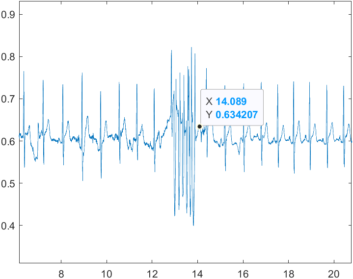

# FYP 2022 - Drowsiness Detection and Anti-Sleep System for Drivers

The following repository containes the following code
1. Blinking rate detection code
2. Seatbelt code with EDR, firmware, and case
3. Steering wheel output visualisation
4. Temperature sensor code
5. Modified CARLA code

## Folder structure
```
Final-Year-Project
│   README.md    
│
└─── blinking-rate-detection
│   │   blinking.py
|
└─── CARLA-modified
|   |   manual_control_steeringwheel.py
│   
└─── seatbelt-unit
|   │   ecg_adjust.m
|   |   main.m
|   |
|   └─── Arduino
|   |   |   firmware.ino
|   |   |   SparkFun_KX13X_Arduino_Library-main.zip
|   |
|   └─── functions
|   |   |   calib_rotation.m
|   |   |   edr1.m
|   |   |   findpeaks1.m
|   |   |   import_ctx_data.m
|   |   |   kernel_matrix.m
|   |   |   KPCA_EDR.m
|   |   |   kpca.m
|   |   |   Nonlinear_filter.m
|   |   |   preimage_rbf.m
|   |   |   RBF_kernel.m
|   |   |   Rpeaks_EDR.m
|   |   |   RSA_resp.m
|   |
|   └─── shell
|       |   PI3MK3M_shell.gcode
|       |   shell.SLDPRT
|       |   shell.STL
|
└─── steering-visualisation
|   |   plotting.py
|
└─── temperature-sensor\temperature_firmware
    |   temperature_firmware.ino
```

## Requirements
To install all the packages needed for ```blinking-rate-detection``` and ```steering-visualisation``` (generated using pip freeze in Python 3.9.12), run the following commmand:
```
pip install -r requirements.txt
```
Note that CARLA will have its set of requirements to run as well. I would suggest setting up two different environments using Anaconda.

# Blinking Rate Detection
```blinking.py``` takes in a video feed and returns the total number of blinks for the given video feed. Run ```requirements.txt``` first to install all the libraries. 
```
python blinking.py 'path/to/video'
```

# CARLA modifications
All the modified CARLA code is currently on a separate computer that I do not have access at the moment. If the modified code is required, please [contact me](#contact).

# Seatbelt Unit
The ```Arduino``` folder should contain the firmware of the seatbelt unit. It also contains the KX13X library file required for the accelerometer.

The shell model for the accelerometer shell should be in the ```shell``` folder

## Usage 
First, create a ```Data``` folder with a folder structure similar to this
```
Data   
│
└─── trial1
│   │   test1
|   |   test2
|   |   test3
|
└─── trial2
|   |   test1
|   |   test2
|
└─── trial3
    |   test1
```
```ecg_idx.m``` should be ran first to find the starting index and ending index for the ECG signal.
1. Change ```trial``` and ```test``` to select the correct data
1. Set ```start_idx = 1``` and ```end_idx = length(ecg)```
2. Run the script and look at the figure 
3. Look for the index of first artefact and last artefact (Image below)
4. Set ```start_idx``` and ```end_idx``` by multiplying X index with the sampling rate (1000 in this case)
5. Check if all ECG peaks are located in Figure 1
6. Check if EDR is extracted in Figure 2

```main.m``` contains the algorithm that extracts respiration rate from seatbelt unit. Change ```trial``` and ```test``` variable to select the correct data. Change ```start_idx``` and ```end_idx``` to the same index from ```ecg_idx.m```

# Steering Visualisation
The code here just plots the steering wheel inputs.

# Temperature Sensor
This code is to used control the temperature sensor. This sensor is not used anymore as it wasn't sensitive enough.

# Seat Sensor
The code for the seat sensor is currently unavailable. If it's needed, feel free to contact me.

# Contact
Should anyone have any questions about the code, feel free to contact me at yangyipoh.pyy@gmail.com

# Resources
- [Mediapipe Tutorial](https://google.github.io/mediapipe/solutions/face_mesh)
- [Eye Aspect Ratio Paper](https://www.ncbi.nlm.nih.gov/pmc/articles/PMC9044337/)