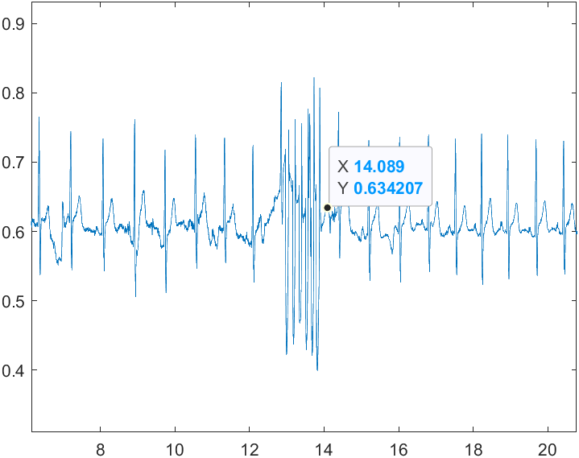

# Seatbelt Unit
This folder (should) contains all the files used for the seatbelt unit

The ```Arduino``` folder should contain the firmware of the seatbelt unit. It also contains the KX13X library file required for the accelerometer.

The shell model for the accelerometer shell should be in the ```shell``` folder

## Usage
```ecg_idx.m``` should be ran first to find the starting index and ending index for the ECG signal. 

1. Set ```start_idx = 1``` and ```end_idx = length(ecg)```
2. Run the script and look at Figure 1
3. Look for the index of first artefact and last artefact (Image below)
4. Set ```start_idx``` and ```end_idx```
5. Check if all ECG peaks are located in Figure 1
6. Check if EDR is extracted in Figure 2



